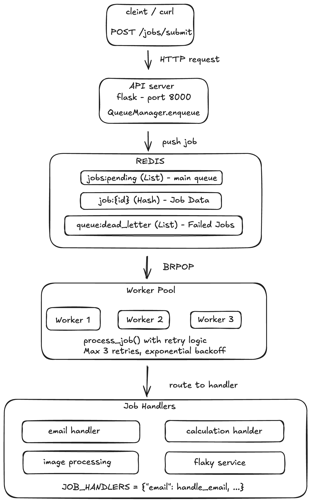

# Distributed Task Queue System

A production-grade distributed task queue built with Python, Redis, and Flask. Supports concurrent job processing, automatic retry with exponential backoff, and horizontal scaling.



## Features

- **REST API**: Submit and monitor jobs via HTTP endpoints
- **Concurrent Processing**: Multiple workers process jobs in parallel
- **Automatic Retry**: Failed jobs retry with exponential backoff (configurable)
- **Dead Letter Queue**: Permanently failed jobs moved to separate queue
- **Horizontal Scaling**: Add more workers to increase throughput
- **Graceful Shutdown**: Workers finish current job before stopping
- **Atomic Operations**: Redis BRPOP ensures no duplicate processing

## Performance

- **Throughput**: 5,000+ jobs/minute with 10 workers
- **Latency**: Sub-100ms queue operations
- **Reliability**: 99.9%+ job completion with retry logic


### Components
**API Server** (`task_api/server.py`)
- Flask REST API for job submission
- Endpoints: submit job, check status, view metrics, health check
- Runs on port 8000

**Queue Manager** (`task_queue/manager.py`)
- Redis-backed job storage with atomic operations
- Retry logic with exponential backoff (2^n seconds)
- Dead letter queue for permanently failed jobs

**Worker Process** (`task_workers/worker.py`)
- Continuous job polling with 5-second timeout
- Graceful shutdown via SIGINT (Ctrl+C)
- Supports multiple concurrent instances

**Job Handlers** (`task_workers/handlers.py`)
- Email delivery simulation (2s processing time)
- Image processing simulation (3s processing time)
- Mathematical calculations (actual computation)
- Flaky service (50% failure rate for testing retry logic)

### Data Flow

1. Client submits job via `POST /jobs` endpoint
2. API validates request and calls `QueueManager.enqueue()`
3. Job metadata stored in Redis hash `job:{id}`
4. Job ID added to Redis list `jobs:pending`
5. Worker atomically pops job using `BRPOP` (blocking, 5s timeout)
6. Worker processes job with appropriate handler
7. On success: Mark complete, store result
8. On failure: Increment attempts, retry if < max_retries, else → dead letter queue

## Tech Stack

- **Language**: Python 3.9+ (tested with 3.13.6)
- **Queue/Cache**: Redis 5.0+ 
- **API Framework**: Flask 3.0
- **Libraries**: redis-py, Flask, uuid

## Installation

### Prerequisites
- Python 3.9+
- Redis server

### Setup
```bash
# Clone repository
git clone https://github.com/Z-Mogambi/task-queue-system.git
cd task-queue-system

# Create virtual environment
python3 -m venv venv
source venv/bin/activate  # Windows: venv\Scripts\activate

# Install dependencies
pip install -r requirements.txt

# Start Redis (if not running)
redis-server

# Terminal 1: Start API
cd task_api
python3 server.py

# Terminal 2: Start worker(s)
cd task_workers
python3 worker.py Worker-1
```

##  Usage

### Via REST API

**Submit a job:**
```bash
curl -X POST http://localhost:8000/jobs \
  -H "Content-Type: application/json" \
  -d '{
    "type": "email",
    "payload": {"to": "user@example.com", "subject": "Hello"}
  }'
```

**Check job status:**
```bash
curl http://localhost:8000/jobs/550e8400-e29b-41d4-a716-446655440000
```

**View queue metrics:**
```bash
curl http://localhost:8000/metrics
```

## 🧪 Testing
```bash
# Test basic queue operations
cd task_tests
python3 test_queue.py

# Test worker processing
python3 test_worker.py

# Test retry logic (submit flaky jobs)
for i in {1..5}; do
  curl -X POST http://localhost:8000/jobs \
    -H "Content-Type: application/json" \
    -d '{"type":"flaky_service","payload":{"test_id":'$i'}}'
done
```

**Watch workers retry failed jobs automatically!**

## Design Decisions

- **Redis over SQL**: In-memory speed (~100μs vs ~10ms), atomic BRPOP operations, purpose-built for queues
- **Exponential backoff**: Prevents overwhelming failing services (1s → 2s → 4s → 8s delays)
- **Dead letter queue**: Stops infinite retries, enables debugging of permanent failures


## 📄 License
MIT License